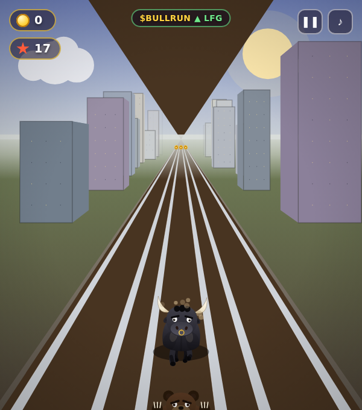
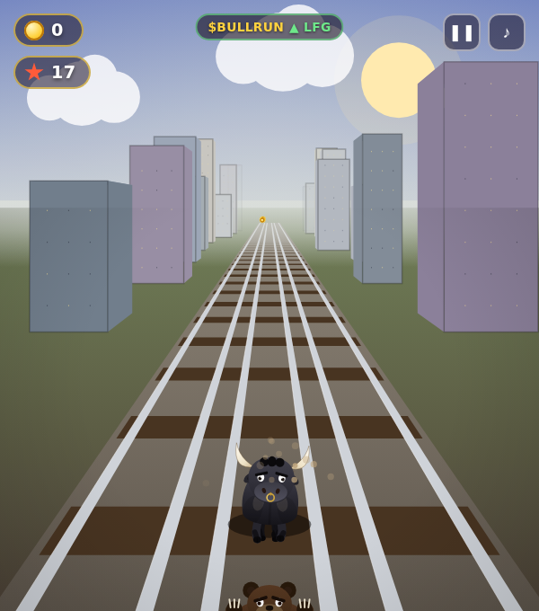

# 🐂 BullRun

A lane-based endless runner set on the railways — **you're a charging bull.** Weave between three tracks, leap over barriers, roll under them, jump onto and ride the roofs of subway trains, scoop up coins, and grab power-ups while the world scrolls faster and faster.

> **Note on originality:** *Subway Surfers* is a trademark of SYBO Games and its art, characters, and branding are copyrighted. BullRun is **not** a copy of that game's assets — it's an original, from-scratch game in the same *genre*. Every visual is drawn procedurally in code (no ripped sprites, no third-party assets) and the star is an original cartoon bull.

## Play it

No build step, no dependencies. Either:

- **Just open it:** double-click `index.html` (it runs straight from `file://`), **or**
- **Serve it** (recommended for mobile testing):
  ```bash
  python3 -m http.server 8000
  # then visit http://localhost:8000
  ```

On a big screen the game presents itself as a centered portrait "card" with a backdrop; on phones it fills the whole screen. The in-game UI scales to the card, not the monitor.

## Deploy to Vercel

It's a fully static site (no build step, no dependencies), so deploying is instant.

[](https://vercel.com/new/clone?repository-url=https://github.com/frieshimself-cpu/bullrun)

**Or from the CLI:**

```bash
npm i -g vercel       # once
vercel                # preview deploy from the project root
vercel --prod         # production deploy
```

**Or from the dashboard:** import the repo at [vercel.com/new](https://vercel.com/new) — there's nothing to configure. Framework preset is **Other**, build command **empty**, and the output is the repo root. `vercel.json` is included (clean URLs + sensible cache/security headers).

### Auto-deploy on every push

You have two ways to make pushes deploy automatically — pick **one**:

1. **Vercel Git integration (recommended, zero secrets).** Import the repo once at [vercel.com/new](https://vercel.com/new) and connect it to GitHub. Vercel then deploys **production from `main`** and a **preview for every other branch / PR** automatically. Nothing else to set up.

2. **GitHub Actions (included in this repo).** `.github/workflows/vercel-deploy.yml` runs on every push: it deploys **production from `main`/`master`** and a **preview from any other branch**. It stays green and skips itself until you add three repository secrets (**Settings → Secrets and variables → Actions**):

   | Secret | Where to get it |
   | ------ | --------------- |
   | `VERCEL_TOKEN` | [vercel.com/account/tokens](https://vercel.com/account/tokens) |
   | `VERCEL_ORG_ID` | run `vercel link`, then read `.vercel/project.json` |
   | `VERCEL_PROJECT_ID` | same `.vercel/project.json` |

   Use this if you'd rather keep deploys in GitHub CI. If you use the native Git integration above, you can delete this workflow to avoid double-deploys.

## $BULLRUN token

The site is wired to a pump.fun token. The mint (contract address) lives in **one place** — the top of [`js/meta.js`](js/meta.js):

```js
const TOKEN_CA = "8gnadF516tcL6SCH32BJP8X7cmMed4Z6bKdQUd1Dpump";
```

From that one constant the site derives:

- The **contract box** on the menu (address + copy button + `pump.fun ↗` and `chart ↗` links).
- **Live price data** pulled from the public [DexScreener](https://dexscreener.com) API every 30s. Before the coin is tradeable DexScreener returns nothing, so the box reads *“goes live on deploy”* and the in-game ticker shows the gameplay pump. **The moment the coin has a market, the ticker and the box switch to the real price, market cap and 24h move** — no redeploy needed.

> Note: this reflects on-chain market data; it is not financial advice, and the “airdrop” copy is flavour text — wire up any real rewards yourself.

## Leaderboard

The 🏆 leaderboard works in two tiers:

- **Out of the box:** a **local, per-device** board (stored in `localStorage`) so posting a score works immediately.
- **Global (cross-device):** add a Redis-compatible KV store and the serverless function at [`api/scores.js`](api/scores.js) becomes a real global board automatically.

To turn on the global board on Vercel:

1. In your Vercel project → **Storage** → create a **KV / Upstash for Redis** database and connect it to the project. Vercel injects `KV_REST_API_URL` and `KV_REST_API_TOKEN` for you. (Plain Upstash works too — it also accepts `UPSTASH_REDIS_REST_URL` / `UPSTASH_REDIS_REST_TOKEN`.)
2. Redeploy. The function reads those env vars; if they're absent it just returns the local-fallback response, so nothing breaks before you set it up.

Scores are stored as a sorted set keeping each tag's best. They're **client-reported**, so treat the board as a fun ranking, not an anti-cheat tournament.

### Top-3 $SOL giveaway wallets

When players post a score they can also drop a **Solana wallet** (validated as a base58 address) so the **top 3** on the board are payout-ready for a SOL giveaway. Wallets are stored alongside the board:

- **Global store:** a Redis hash `bullrun:wallets:v1` (tag → wallet), returned with the scores. The leaderboard shows a `◎ short…addr` badge on the top-3 rows (or `◎ no wallet` if one hasn't been provided yet) so you can see who's eligible at a glance. Hover a badge to read the full address.
- **No store configured:** the wallet is kept in `localStorage` with the local board.

To pay out, read the top-3 wallets from the board (or directly from the `bullrun:wallets:v1` hash in your KV store) and send the SOL yourself — the site only **collects** wallets, it doesn't move funds.

## The dark "wedge in the sky" — fixed

A reported glitch: a hard **dark brown triangle** in the upper-centre of the screen, apex at the vanishing point — most obvious on a wide screen in daylight.

**Root cause: a perspective-projection bug in the railway sleepers (ties).** Each tie is a quad drawn between two depths, `zz` (far edge) and `zz − 0.45` (near edge). The draw loop only checked that the *far* edge stayed in front of the camera. When the *near* edge slipped behind the focal plane (`z + CAM_BACK ≤ 0`), `project()` returned a **negative scale**, which flipped that tie's quad up and across the horizon — painting a giant inverted brown triangle (tie-coloured) over the sky. It scaled with screen width, which is why it looked like a big wedge on desktop. The fix clamps the **near** edge to the near plane too (`zNear = zz − 0.45; if (zNear < Z_NEAR) continue;`), so a tie quad can never wrap behind the camera.

Verified across a full sweep of 7 aspect ratios × the whole day/night cycle: the wedge went from up to ~34,000 stray pixels to **zero in daylight at every aspect**.

| Before (the wedge) | After (fixed) |
| --- | --- |
|  |  |

## Controls

| Action        | Keyboard            | Touch            |
| ------------- | ------------------- | ---------------- |
| Change lane   | `←` / `→` (or A/D)  | swipe left/right |
| Jump          | `↑` / `Space` (W)   | swipe up / tap   |
| Roll / slide  | `↓` (S)             | swipe down       |
| Pause         | `P`                 | ❚❚ button         |
| Mute          | `M`                 | ♪ button         |

## Features

- **Pseudo-3D railway** — a real perspective-projection renderer (no libraries): three tracks converging to a vanishing point, a gravel bed with scrolling wooden sleepers and steel rails, a passing **city skyline** with lit windows, parallax clouds and a sun. The camera rises with the bull so jumps and roof-rides read clearly.
- **A hand-coded black bull** — muscular charcoal hide with a rim-lit back, curving ivory horns, a brass nose ring, and a 4-beat gallop whose legs pump under the body; plus distinct **jump-tuck** and **roll-squash** poses, a swishing tail and dust kick-ups.
- **An angry bear chaser** (think the Subway Surfers guard) — it lurks at the bottom of the screen as you run, **surges up when you stumble** (a hoverboard/shield save), and **lunges in to grab the bull** when the run ends.
- **Obstacles**, procedurally arranged into *always-solvable* patterns:
  - 🔴 **red (bearish) candlesticks** — the bull leaps over them
  - `ROLL` overhead bars — slide under them
  - solid blockers — switch tracks
  - **subway trains** — switch away **or jump on top and ride the roof** (with a coin trail up there for the brave)
- **Memecoin flavour** — a pumping **`$BULLRUN ▲ +%`** ticker, `$` token coins, memecoin-slang pop-ups (PUMP combos, WAGMI / to-the-moon milestones, themed power-ups like 🚀 LIFTOFF and 💎 DIAMOND HANDS), a **REKT!** game-over with a rotating rekt-reason, and **airdrop** banners.
- **Coins** in arcs and trails, with a satisfying spin + pickup spark.
- **Power-ups:**
  - 🚀 **jetpack** — blast above everything on a stream of coins
  - 🛹 **hoverboard** — survive a crash and keep charging
  - 👟 **super sneakers** — sky-high jumps
  - 🧲 coin magnet · ×2 score multiplier · 🛡 shield
- **Living world** — a **day → dusk → night → dawn cycle** that starts in bright daylight and drifts through the day as you run (soft colour grade, never a muddy wash): shifting sky gradients, a sun that sets into a cratered moon, stars, and city windows that light up after dark.
- **Combos & milestones** — chained coin pickups build a score multiplier (×2, ×3…), distance milestones pay out bonuses, and floating pop-ups call out power-ups, combos and milestones.
- **Juice:** camera shake, hit flash, particle bursts, jet exhaust, speed lines and a vignette at high velocity, ramping difficulty.
- **Progression:** a persistent **coin bank** and **best score** (saved in `localStorage`), shown on the menu. Pause-on-blur, mute, full touch + keyboard support.

## Project layout

```
index.html      # markup + HUD/overlays
css/style.css   # all styling (HUD, menus, buttons)
js/game.js      # the entire game engine (projection, spawning, physics, rendering, audio)
```

Everything is vanilla HTML/CSS/JS. Sound effects are synthesized live with the Web Audio API — there are no audio files either.

Charge! 🐂💨
